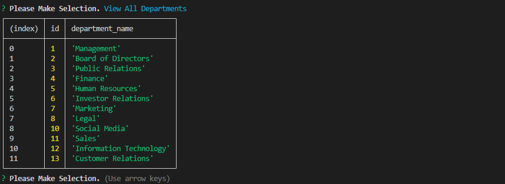
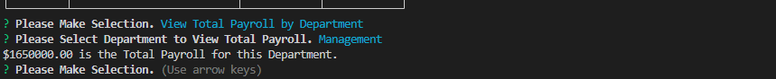

# Employee Tracker

## Table of Contents

* [Description](#description)
* [Installation](#installation)
* [Usage](#usage)
* [Credits](#credits)
* [Screenshots](#screenshots)
* [Video](#video)
* [Link to Website](#link-to-website)
* [License](#license)

## Description

This is a command line application that manages Acme Co's employee database. This application allows the user to view all departments, view all roles, view all employees, add a department, add a role, add an employee, update an employee role, update an employee manager, view employees by manager, view employees by department, delete department, delete role, delete employee, and view total payroll by department. 

## Installation

In order to use this application, Node.js and MySQL must be installed. Once the code is downloaded, the user will need to install all dependencies by entering the following command into their CLI: npm install. The user will also need to source schema.sql and seeds.sql in order to begin with Acme Co's initial employee database.

## Usage

Please ensure that all installation procedures are followed first in order for application to function properly. Next, please enter the following command into the CLI: npm start. This will provide the user a menu that will allow them to execute their desired command. Use up and down arrows to navigate the menu. The Enter key will allow the user to make a selection.

## Credits

Tutor Assistance provided by Michell Brito

Guidance Provided by ASKBCS Learning Assistant: "Chipo" (Username: cphiri)

Application done in collaboration with coding students Kalyn Sifuentes, Joshua Hale, and Angela Cortes.

YouTube Video Accessed for function assistance: https://www.youtube.com/watch?v=m9CQxR0AfiQ&t=679s by Thomas Calle

Company Department Names Source: https://simplicable.com/en/company-departments

## Screenshots

Main Menu of Application:

View All Departments Screen:

View All Roles Screen:

View All Employees Screen:

View Employees by Manager Screen:

View Employees by Department Screen:

View Total Payroll of Department Screen:

## Video

## Link to Website

N/A

## License

This application is licensed under the Apache 2.0 License.

https://opensource.org/licenses/Apache-2.0